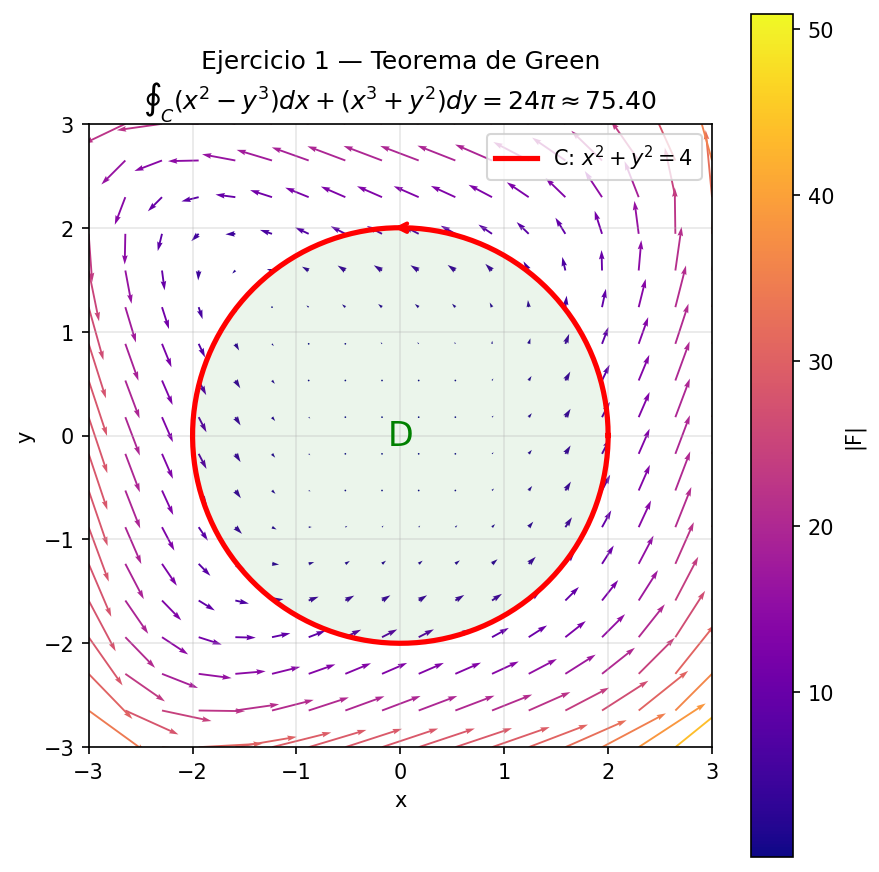
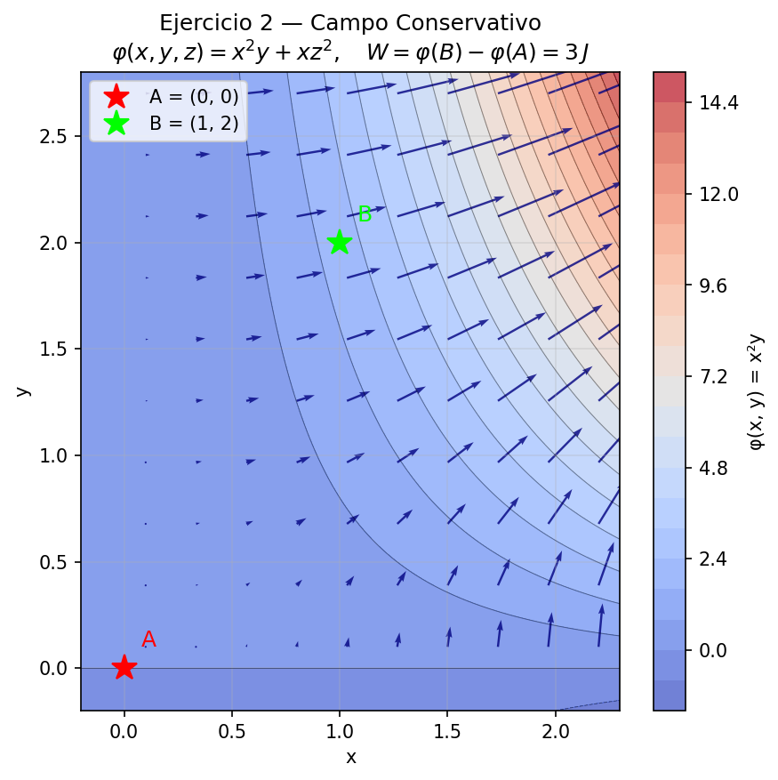
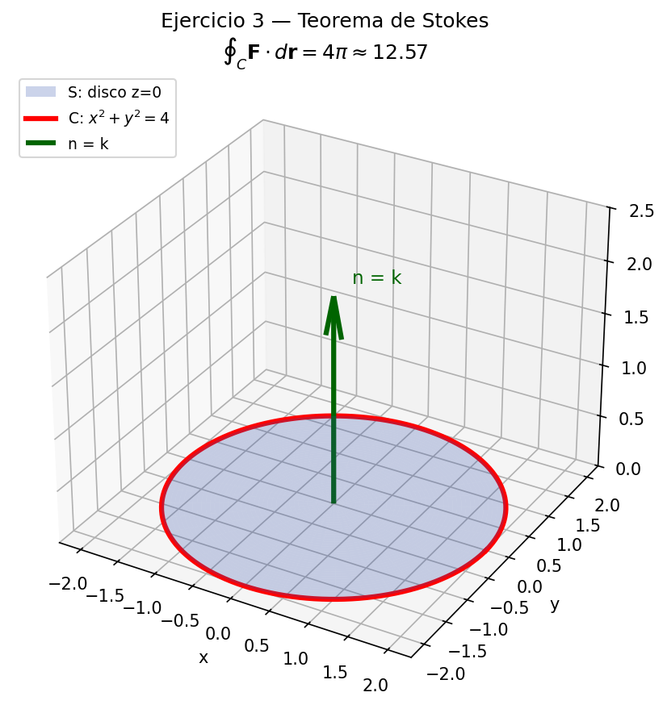

# Campos Vectoriales Vivos

**Universidad CIAF** — Ingenieria en Desarrollo de Software  
Calculo Multivariado — Proyecto Integrador Final 2026  
Prof. Aimer Antonio Rivas Montoya

---

## Integrantes

| Nombre | 
|---|
| Johan Quintero |
---

## Descripcion

Motor de calculo vectorial en Python que resuelve y visualiza tres problemas del parcial final de Calculo Multivariado: integrales de linea, Teorema de Green, campos conservativos y Teorema de Stokes.

---

## Estructura del repositorio

```
campos-vectoriales/
├── README.md
├── requirements.txt
├── src/
│   ├── vector_engine.py
│   └── visualizacion.py
├── tests/
│   └── test_engine.py
├── output/
│   ├── fig_green.png
│   ├── fig_potencial.png
│   └── fig_stokes.png
└── docs/
    └── informe.pdf
```

---

## Requisitos previos

- Python 3.10 o superior
- pip actualizado
- Para ver archivos PDF en VS Code: instalar la extension **vscode-pdf**

---

## Instalacion

```bash
git clone https://github.com/johanqu/campos-vectoriales.git
cd campos-vectoriales
pip install -r requirements.txt
```

---

## Uso

Ejecutar el motor de calculo:
```bash
python src/vector_engine.py
```

Generar las visualizaciones:
```bash
python src/visualizacion.py
```

Correr las pruebas unitarias:
```bash
pytest tests/test_engine.py -v
```

---

## Resultados analiticos vs numericos

| Ejercicio | Analitico | Numerico | Error |
|---|---|---|---|
| 1 - Green | 24pi = 75.398224 | 75.398224 | 0.0000% |
| 2 - Conservativo | 3.0000 J | 3.000000 J | 0.0000% |
| 3 - Stokes | 4pi = 12.566371 | 12.566371 | 0.0000% |

Todos los errores son menores al 1% requerido.

---

## Visualizaciones

**Figura 1 — Teorema de Green**  
Campo vectorial F coloreado por magnitud con el circulo C de radio 2.



**Figura 2 — Campo Conservativo**  
Curvas de nivel de la funcion potencial y gradiente con los puntos A y B.



**Figura 3 — Teorema de Stokes**  
Disco S en z=0, borde C en rojo y vector normal n=k.


